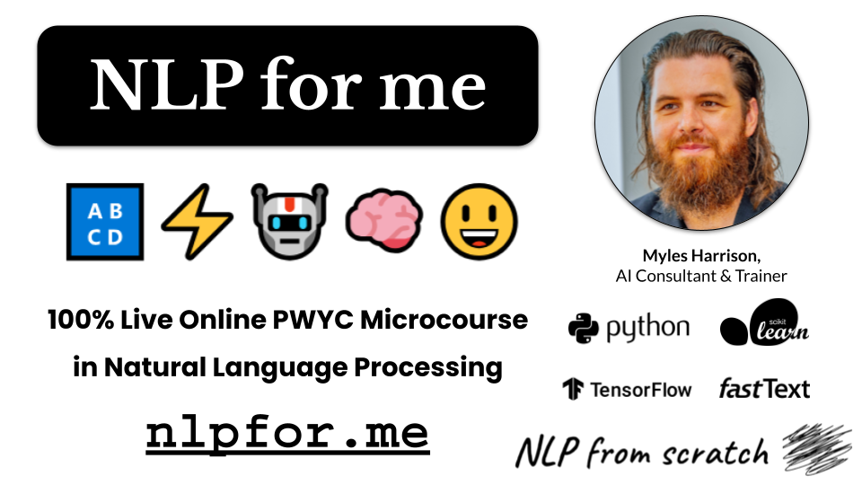

# NLPfor.me 🔠⚡🤖🧠😃

A Pay-What-You-Can (PWYC) Microcourse in Natural Language Processing

**Date**: 📅 October-November 2024  
**Author** ✍️: Myles Harrison, AI Consultant & Trainer  
**Link** 🔗: [nlpfor.me](https://nlpfor.me)

## Curriculum
The course covers the following at a high level, with simple code examples to get the non-technical practitioner unfamiliar with NLP and machine learning started:
- **Part 1 - Introduction to NLP** (October 7th, 2024)
  - Slides: <a href="slides/1. NLP for me - Introduction to NLP.pdf">1. NLP for me - Introduction to NLP.pdf</a> 
  - Notebook: <a href="notebooks/1. NLP for me - Intro to NLP and Python.ipynb">1. NLP for me - Intro to NLP and Python.ipynb</a>
  </a>
- **Part 2 - Data Acqusition and Processing** (October 14th, 2024)
  - Slides: <a href="slides/2. NLP for me - Data Acquisition and Preprocessing.pdf">2. NLP for me - Data Acquisition and Preprocessing.pdf</a> 
  - Notebook: <a href="notebooks/2. NLP for me - Data Acquisition and Preprocessing.ipynb">2. NLP for me - Data Acquisition and Preprocessing.ipynb</a>
  </a>
- **Part 3 - Machine Learning and Sentiment Analysis**
  - Slides: <a href="slides/3. NLP for me - Machine Learning & Sentiment Analysis.pdf">3. NLP for me - Machine Learning & Sentiment Analysis.pdff</a> 
  - Notebook: <a href="notebooks/3. NLP for me - Machine Learning and Sentiment.ipynb">3. NLP for me - Machine Learning and Sentiment.ipynb</a>
  </a>  
- **Part 4 - Unsupervised Methods for NLP**
- **Part 5 - Deep Learning for Natural Language**
